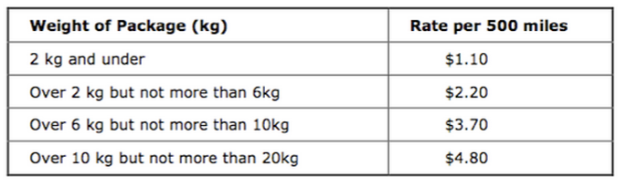

# Scientific Programming with 

## Programming Exercise 3 - Shipping Cost
A shipping company determines how much it charges its customers based on weight of the package and distance shipped.

Prices are determined by the following table

Allow a user to enter the weight and distance, compute price.

** Reminder -  ** you learn by *doing* not watching.  Do this program yourself first!  Then watch how I did it!

### Solution Video
<iframe width="420" height="315" src="https://www.youtube.com/embed/nSdTr7leklA" frameborder="0" allowfullscreen></iframe>

### Solution Code
[pe3.py](pe3.py)

