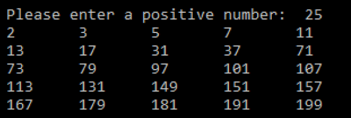

# CMPS 130 - Homework #1


An Emirp is a prime number whose reversal is also a prime. For example, 17 is a prime and 71 is a prime, so 17 and 71 are emirps. Write a program that prints out the first N emirps, five on each line.

Calculate the first N *emirp* (prime, spelled backwards) numbers, where N is a positive number that the user provides as input. 

<div style="clear:both"/>
## Implementation Details
You are required to make use of 2 functions (which you must write).

```
isPrime(value)  # Returns true if value is a prime number.
reverse (value) # Returns the reverse of the value (i.e. if value is 35, returns 53).
```

You should use these functions in conjunction with logic in your main part of the program, to perform the computation of N emirps and print them out according to the screenshot below. 



The general outline for your program would be as follows:

```
Step 1: Ask user for positive number (input validation)
Step 2: Initialize a variable Test to 2
Step 3: While # emirps found is less than the input:
		Call isPrime with Test, and call it again with reverse(Test). 
		If both are prime, print and increment number of emirps found.
Test++
```
*Hint - to reverse the number, turn it into a string and then reverse the string.  Then turn it back into an int!*
