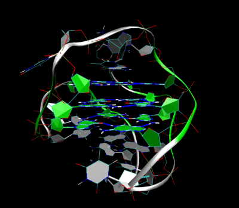
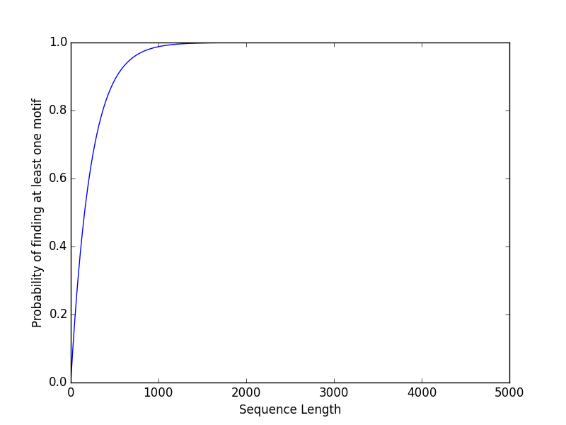
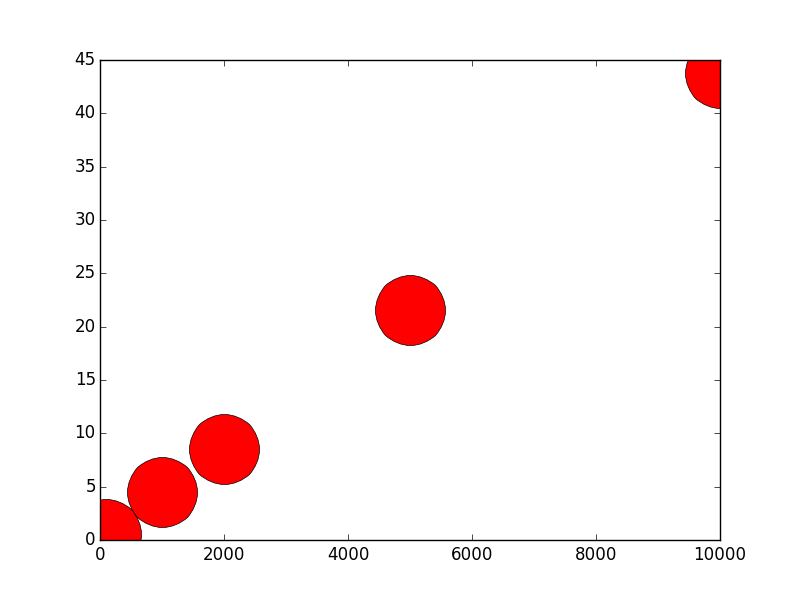

# CMPS 130 - Homework #4

<figure style="width:300px; margin-left:1em;margin-bottom:1em;float:right">
  
  <figcaption>3D Structure of the intramolecular human telomeric G-quadruplex in potassium solution (PDB ID 2HY9).  [Source](http://en.wikipedia.org/wiki/G-quadruplex)</figcaption>
</figure>
Our genome - DNA/RNA - are made up of long strings of nucleotides - guanine (G), adenine (A), thymine (T), or cytosine (C).  Genes are subsequences of our genome responsible for producting the specific protiens that make up our bodies.  Genes are typically between 2000 and 10000 nucleotides long.

Within genes, there exist even smaller subsequences - called *motifs*.  Motifs might be very short - `TTATT`, or longer and more complex, such as a [G-quadruplex](http://en.wikipedia.org/wiki/G-quadruplex) - `GGATGAGCCTGTGGGTGGAGGGCAGTGGAGCGGGCTGGG`.  These motifs often perform very specific biological functions, such as controlling protein production.

The human genome has been mapped, and there are downloadable databases of text files containing long strings of G's, A's, T's, and C's representing our genes (and those of many other organisms).  In Bioinformatics, computer programs are used to analyze and search this genetic data for patterns and motifs.

Since most of our genetic material is [non-functional](http://en.wikipedia.org/wiki/Noncoding_DNA) (or at least, [so we thought](http://healthland.time.com/2012/09/06/junk-dna-not-so-useless-after-all/)), an important aspect of using computational tools for classifying motifs is determining whether motifs are occuring at random, or because they are serving a real purpose.  A key method bioinformatics researchers use is to calculate the *likelhood* of finding a specific motif among a **random** sequence.  If a specific motif occurs in the genome far more frequently than the *expected* frequency, we begin to assume the motif is doing something important.  It's at that point that real "wet lab" tests will begin to actually investigate the specific motif in more detail.

For this assignment you will write a program that would help a scientists determine if a specific motif is worth investigating by reporting its *expected* frequency in a number of different ways.

## Part 1 (30 points)
Your program should start by asking the user to enter a specific motif - a sting of A, T, C, G's.  Your program should ensure that only ATCG combinations are permitted, if the user enters an invalid string allow them to try again until they do.

It turns out that A, T, C, and G do not appear at the same frequency in the genome, and their distributions vary widely across different genes.  Next, ask the user to enter the frequency at which each nucleotide exists in their hypothetical genome.  

Using those frequencies, calculate the likely hood that a *single* sequence of the *same* length is precisely the motif that the user entered.

For example - if the frequencies are as follows:  A= 20%, T = 28%, C = 23% and G = 29%, the following motif has a likelyhood of appearing:

```
Motif:  CGGA
.23 * .29 * .29 * .20 = 0.0038686
```
Meaning if you were to pick 4 nucleotides at complete random, you'd expect to see CGGA roughly 0.4% of the time. This makes intuitive sense, since there are 4 nucleotides and 4 options (A T C or G), there are 4 <sup>4</sup> = 256 combinations.  1 / 256 is about 0.0039, and we see a slightly different likelyhood for our motif because the frequency of A, T, C, and G are **not** equal.

With a different set of frequencies we'd get a very different number:
```
A = 30%
T = 5%
G = 40%
C = 25%

Motif: CGGA
.25 * .40 * .40 * .30 = 0.012 (or 1.2%)
```
**Important** Your code should detect a frequency set that doesn't add up to 100%.  If the 4 values do not add up to 100%, you can print a message and terminate the program.

## Part 2 (40 points)
The likelhood of a motif appearing at one specific location seems really low - because it is!  However, because genes typically range between 2000 and 10000 nucleotides, the chance that you find a given motif at least once **anywhere** in the gene is actually a bit higher.  If you have a gene of 5000 nucleotides, you essentially have 5000 opportunities to start one of these motifs!  

The likelyhood of finding the motif from part one (using the first set of frequencies) at least once is equal to 1 minus the probability of *not* finding the motif 5000 times in a row!  So, the calculation is quite simple:

For a sequence of size N, and a probability from part 1 P, the probability 1 - (1-P)<sup>N

Using PyLab (matplotlib) create a plot that shows the user probability of finding at least one of their motifs in sequences ranging in length from N to 5,000 - where N is the length of the motif they entered.  The x-axis should be the sequence length and the y-axis should be the probability of finding the sequence at least once.

## Part 3 (30 points - total)
Another important measure a bioinformatics researcher will employ is **enrichment**.  Enrichment is the **number** of times a motif is found within a sequence.  While our calculation in Part 2 tells us the likely hood of a motif occuring *at least once*, in this part we'll use a Monte Carlo simulation to tell us exactly how many times we should expect to find the motif in a sequence.

### Part 3a (15 points)
For this part, you'll first need to write some code (probably a function) that generates a random sequence of length N based on the frequency distributions for A, T, C, and G the user entered.  Here's how:

Lets say the frequencies are as follows:  A= 20%, T = 28%, C = 23% and G = 29%

For each nucleotide in your sequence, create a random floating point number (`import random ... random.random()`).  If the value is < .20, then assign A. If the value is >= .2 and < 0.48, then assign T.  If the value is >= 0.48 and < 0.71, assign C.  Finally, if the value is > =.71, assign G.  Essentially, you are dividing the number line of real numbers between 0 and 1.0 into regions proportional to the frequencies, and then assigning the letter by which region the random number fall into.

### Part 3b (15 points)
Now generate a *dot* plot for N = 100, N = 1000, N = 2000, N = 5000, and N = 10000 (where N is the length of the sequence).  For each of these values, generate 100 random sequences of the given length and count how many times you find the motif the user entered in each random sequence you generate.  The y-axis of the plot will be the *average* number of times you found the motif, for the given sequence length, in the 100 random samples you generated.

Note - its easy to count the number of motifs that occur in a sequence - you can use the string's `find` method.  You can read about it [here](https://docs.python.org/release/3.1.3/library/stdtypes.html#str.find).

The `find` method accepts a string to search for within a string.  It returns the (first) index where that substring was found, and returns -1 if it was not found.  `find` also accepts a starting position.  So, to count how many times a substring `sub` is found in a string `str` you'd call `str.find(sub, start)`.  The first time you call this start will be zero.  If the method returns -1, `sub` doesn't appear in `str`.  If the method returns some index `i` then `sub` is in `str` once.  You then set `start` to `i+1` and recall `str.find(sub, start)`.  Repeat this process until the find method does indeed return -1 - and keep count of how many times it returns a value >= 0.

### Grading
I'll run your code with a few test cases, but here is one that will help you understand if you have the right values.

<pre>
Motif:   CGGA

| Nucleotide | Frequency |
|------------|-----------|
| A | 20%|
| T | 27%|
| C | 19%|
| G | 34% |

- Probability of appearing in a sequence N = 4 is 0.004392800000000001 ( 0.4392800000000001 %)
- Plot of probability of finding at least one of these motifs in a sequences of length N to 10,000

- Expected number of motifs in sequences of length N = 100, N = 1000, N = 2000, N = 5000, and N = 10000

*note - I made marker size = 50**
</pre>
```
