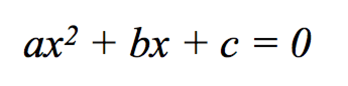
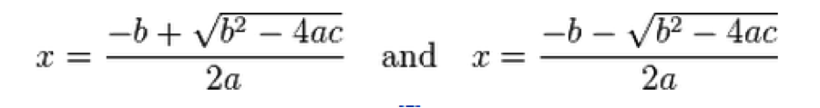

# Problem Description
Write a program that implements root solving using the quadratic formula.

Given a polynomial equation of the following form:



You can solve for **x** using the following formula:


This formula is really two, due to the **+/**:



The answers to these equations give us **x** values that satisfy the polynomial equation **ax<sup>2</sup> + bx + c = 0**.  

**These are called roots**.

## Having no roots
While there are two equations, depending on the coefficients **a, b, and c**, neither equation may be solvable, or each of the two equations may yield the exact same result.

For example, let's take 
```
a = 3, b = 1, and c = 9
```
Notice that **b<sup>2</sup>** is 1.  **4ac** is 108.  This makes the *discriminant* of **b<sup>2</sup> - 4ac** **negative**.  In this case, neither formulas are valid (you can't compute the square root of a negative value), and thus there are **no roots**.

## Having only one root
As another example, consider the situation where
```
a = 1, b = 2, and c = 1
```

In this case **b<sup>2</sup>** is 4.  **4ac** is also 4.  This makes the *discriminant* of **b<sup>2</sup> - 4ac** **zero**.  Since the square root of zero is just zero, both of the equations will give the same answer - in this case:

*root #1* = (-b + 0) / (2a) = -1
*root #2* = (-b - 0) / (2a) = -1

In this case, you *only have one root*.

## Having two distinct roots
Finally, there are plenty of situations where the discriminant is positive.

Consider the situation where
```
a = 1, b = 10, and c = 2
```

In this case **b<sup>2</sup>** is 100.  **4ac** is 8.  This makes the *discriminant* of **b<sup>2</sup> - 4ac** is **92**.  

*root #1* = (-b + 0) / (2a) = -9.79583
*root #2* = (-b - 0) / (2a) = -0.204168

# Program requirements
Sometimes in life you are asked to solve a problem in a very specific way, even though you might be able to think of alternative methods.  **This is such a case**.  While you could certainly solve this problem without the use of functions, and without using pass by reference - the **entire point of this exercise** is to use these tools!

You are being asked to utilize a function call `quad` - which is called by supplying it the `a`, `b` and `c` coefficients.  The function should `return` the **number of roots** the polynomial equation using these coefficients has.

## Step 1 - returning the number of roots
Lets start just with this requirement - which leaves out the notion of actually computing the roots themselves (we'll get there).

The signature (function prototype) of the function would be as follows:

```c++
int quad(double a, double b, double c);
```

The parameters of the function are the three coefficients - which would come from the user of your program.  They are doubles, since there is no reason to limit the coefficients to whole numbers.

The return value is a single integer representing the number of roots - and the only reasonable values are 0, 1, or 2.  

Lets figure out the return value by calculating the discriminant.

```c++
int quad(double a, double b, double c) {
    double discriminant = b * b - 4 * a * c;
    if ( discriminant < 0 ) {
        // there are no roots, like
        // the example of a = 3, b = 1, and c = 9
        return 0; 
    }
    else if (discriminant == 0) {
        // there is one root, like the example
        // a = 1, b = 2, and c = 1
        return 1;
    }
    else {
        // There are two roots (yet to be calculated)
        return 2;
    }
}
```

## Computing and "returning" the roots
If we were to imagine a main function calling the quad
function, it would start to look like this:

```c++
int main() {
    double a, b, c;
    int roots;

    // Prompt and read in a, b, and c coefficients
    // .... left to later


    roots = quad(a, b, c);

    switch (roots) {
        case 0:
            cout << "Sorry, no roots could be solved." << endl;
            break;
        case 1:
            cout << "There is one root.  Not telling you what it is yet..." << endl;
            break;
        case 2:
            cout << "There are two roots - which will remain secret for now..." << endl;
            break;
    }
}
```
While this program is great... it would be a lot better if it actually told the user what the roots were.  **This is where function design becomes important**.  Ideally, the `quad` function could **also return the roots**, but we know (right?) that functions can only return one thing.

### Using pass-by-reference
Pass by reference lets us get around this problem.  When passing parameters into a function with an ampersand (&), the function can make changes to the parameter, and the calling function will be able to see those changes.

In our main function, we will now declare too more variables, `root1` and `root2`.  They will be doubles, and we will pass those variables *into* `quad` - EVEN THOUGH THEY HAVE NO VALUE YET.

```c++
int main() {
    double a, b, c;
    double root1, root2; // variables to hold the roots
    int roots;

    // Prompt and read in a, b, and c coefficients
    // .... left to later

    // Pass the variable into quad
    roots = quad(a, b, c, root1, root2);

    // ... printout the results (see below)
}
```

Of course, to be able to do this, we must change the signature of `quad` to accept a 4th and 5th parameter - by reference.


```c++
int quad(double a, double b, double c, double &r1, double &r2);
```
*Notice that there is no need for the parameters to be named the same as the variables in main...*

Inside `quad` we can now calculate the actual values of `r1` and `r2`.  When we assign them, we **are really assigning the values to `root1` and `root2` found in main - due to the way pass by reference works.

```c++
int quad(double a, double b, double c, double &r1, double &r2) {
    double discriminant = b * b - 4 * a * c;
    if ( discriminant < 0 ) {
        // there are no roots, like
        // the example of a = 3, b = 1, and c = 9
        return 0; 
    }
    else if (discriminant == 0) {
        // there is one root, like the example
        // a = 1, b = 2, and c = 1
        
        r1 = (-b + sqrt(discriminant)) / (2 * a);
        
        return 1;
    }
    else {
        // There are two roots
        
        r1 = (-b + sqrt(discriminant)) / (2 * a);
        r2 = (-b - sqrt(discriminant)) / (2 * a);
        
        return 2;
    }
}
```

Notice that we only calculate `r1` and `r2` when they have values - based on the sign of the discriminant.

### Putting the program together
Now, within main, we can print the values held in `root1`     and `root2` to complete the program.

```c++
int main() {
    double a, b, c;
    double root1, root2; // variables to hold the roots
    int roots;

    cout << "Please enter coefficient A:  ";
    cin  >> a;

    cout << "Please enter coefficient B:  ";
    cin  >> b;

    cout << "Please enter coefficient C:  ";
    cin  >> c;


    roots = quad(a, b, c, root1, root2);

    switch (roots) {
        case 0:
            cout << "Sorry, no roots could be solved." << endl;
            break;
        case 1:
            cout << "There is one root, " << root1 << endl;
            break;
        case 2:
            cout << "There are two roots - " << root1 << " and " << root2 << endl;
            break;
    }
}
```

The complete source code is here [quadratic-pass-by-reference.cpp](pass-by-reference-example-quadratic/quadratic-pass-by-reference.cpp).  Make sure you download it and test it out!