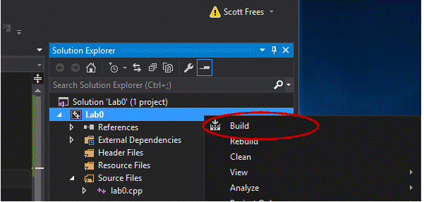

# Visual Studio 2019 - Community Edition

*Preferred source code editor for CMPS 147 and CMPS 148*

In nearly 15 years teaching this course, I can without a doubt say the #1 reason students fail the course, is because they neglect to install Visual Studio and learn how to create their first program until their first assignment is due. They quickly find that it wasn't as easy as they thought (or something goes wrong with the installation), and they fall behind.  If you fall behind in this class, you are unlikely to catch up.  Don't be one of these students.

# Pre-Requisites

Visual Studio is a Microsoft product - it **ONLY works on Microsoft Windows**. If you are using an Apple computer, you CANNOT install Visual Studio (there are similarly named products, from Microsoft, but they do not support C++ code development).  Since you will be required to use Visual Studio during exams, in class, on lab machines, you are STRONGLY encouraged to obtain access to a Microsoft Windows PC for this course.

Visual Studio can be installed on any Microsoft Windows operating system - namely, Windows 7, Windows 8, Windows 8.1, and Windows 10.  Visual Studio is free for non-commercial use.

**Version note**:  Visual Studio is released nearly every year - so there is a Visual Studio 2012, 2013, 2015,2017, 2019, etc... For our class, the version DOES NOT MATTER. If you've installed an earlier, or later, version of Visual Studio, the instructions for using it will be similar as is in this document - there is ABSOLUTELY no benefit to specifically using the 2019 version, as long as you have C++ installed (see below), you will have no problems with other versions (dates) of Visual Studio.

# Installation

Go to [https://visualstudio.microsoft.com/vs/](https://visualstudio.microsoft.com/vs/) to download Visual Studio **Community Edition**.  If that link does not take you to a download page (seen below), please do a Google web search for "Visual Studio 2019 Community Edition" - Microsoft sometimes changes the URL addresses, but the program is easily found through a web search.

# Step 1:  Click "Community 2019"
Save the file to a location where you can find it once it completes - such as the Desktop.  The file will be called "vs_Community.exe" (or similar). You are downloading A SETUP FILE, not actually Visual Studio.  Once you've completed installing Visual Studio (as shown below), you may remove this setup file from your computer.

 
# Step 2:  Install Visual Studio
Double click on the .exe file you've downloaded (or just choose "Run" if your web browser gives you that option).  Please follow the next 3 sub-steps extremely carefully, **you cannot choose the default options** - you must customize the installation.

**Check off Desktop Development with C++**.  Then click Install

Visual Studio is a huge program - depending on your internet connection and the speed of your computer, this installation process could run for a significant amount of time (hours, potentially). Keep your laptop plugged in, don't let it go into hibernate/sleep mode, and be patient.

# Step 3:  Launch Visual Studio

Remember, the file you downloaded from the internet at the beginning of Step 2 is NOT Visual Studio, it's an installation file.

When the setup completes, it will launch Visual Studio

In general, to launch Visual Studio, click the Start Menu, Click All Programs, and scroll to Visual Studio.

Alternatively, type "Visual Studio" into the search box (Windows 10).

## Registration

At some point (either during installation, or some time afterwards, you will be asked to register your Visual Studio installation). Registration is eventually required, but IT IS FREE.  Please simply sign up for a Microsoft account if you do not already have one.Until you are prompted to register, do not concern yourself with registering.  There is ABSOLUTELY no difference between registered/unregistered installations.

# Step 4:  Creating a C++ Program

Visual Studio organizes coding into "Solutions" - which contain "Projects", which are your individual programs. The first step to creating a C++ project is being cognizant of what options you are choosing and where you are storing your files.

To begin, click New Project

 
Now choose the Project Type, which is always **Empty Project**.

There are literally hundreds of types of projects in Visual Studio.  We will only use one, and it will be same one every time!  If you choose the wrong one, NOTHING will work.

## Location
Projects (programs) are saved to your computer.  If you blissfully click through this step without choosing the location carefully, you won't be able to find your program later to either run it, or submit it.  In the screenshot above, I chose the Desktop. You can Browse to any location you wish.

## Select "Place Solution and Project in same directory"
If you do not do this, your file structure will be different (not wrong, just different) than all of the rest of the examples below...
 
## Name your project
**PLEASE. PLEASE. PLEASE do not include spaces in the name of your projects**.  It will cause constant aggravation for you in the long run. Choose meaningful names, for example, if you are starting Lab #3, name your project Lab0.

After doing this, you should notice that a new folder, named the same as your project, has been created in the location you specified.

*Note that the following steps contain screenshots from an earlier version of Visual Studio.  Unlike the steps above, very little has changed (colors, etc.) from year to year, so I have not replaced the images.*

# Step 5:  Create a C++ source code file
On the right hand side, locate the "Solution Explorer", which should have an entry for your project. Right click on "Source Files", choose Add, and then choose "New Item".

Choose C++ File, and select a name for your file.

 

Again, PLEASE do not include spaces in filenames.  Again, choose names meaningfully - just a little bit of thought goes an awfully long way in making your life easier over the course of the semester.  Ending up with 100's of files named "Source.cpp" is foolish and shortsighted, and will make finding things later impossibly frustrating.  If you are writing your solution for Lab #3, name your file lab0.cpp please!

Again, you should note that doing so will create the cpp file inside the project directory.
 

# Step 6:  Write some code
Here's a simple C++ program - type it in exactly as is shown.

 
# Step 7: Build your program
Within the Solution Explorer, right click on your Project and select Build.

At the bottom of the window, you should see the build status change to "Build succeeded".  If you don't, there are errors in the code you typed. Check carefully.  **Details matter**.

 

The result of this process is an .exe file within the Debug directory of your Project.  You should verify it is there:

Inside Debug folder...

 
# Step 8: Run your program

You shouldn't attempt to run your programs by clicking on them - you need to use the Command Prompt. In the Windows search box, type "Command Prompt"

 

Once you have the command prompt open, you must navigate to the location you saved your project to. In this case, since I saved it to the Desktop, I can type "cd Desktop", cd "Lab0', and then cd "Debug" to get to the correct directory. If you saved your program to another location, your steps will be slightly different.Please view the course videos for additional help with this step. You can type "dir" to list the current directory - you'll see your .exe file there.

**Note**: no one likes the command prompt the first time they use it.It's tricky, and you need to remember commands.  The good news is that to run the last program you'll write in this class, you will follow the exact same steps as you do in the first program - we do the same thing EVERY time.  It will be easy soon..

**To run your program**, just type the program name:

 

 

**Tip**: Don't close your command prompt.For every program you create, you are likely to go in a cycle where you write some code, build, and run - over and over again until you are done (and it is correct). You can keep the command prompt open the entire time, and simply retype "Lab0.exe" instead of navigating directories all over again!

# Step 9: Submitting assignments
There is nothing more frustrating than working hard on a program, submitting it, and then receiving a zero because you uploaded the wrong file.Unfortunately, this happens all too often - don't let it happen to you!

The only files I will EVER ask you for are the files with your source code.  They have an extension of .cpp, and their icons in Windows look like this:

The .cpp file is located in the Project directory (NOT in the Debug Directory).

If you submit solution files (.sln), project files (.proj), or executables (.exe), or anything else other than the .cpp file, **YOU WILL RECEIVE NO CREDIT**. This is surprising easy to do, since they are likely all named the same (Lab0.sln, Lab0.proj, Lab0.cpp, Lab0.exe), and by default Windows often hides the extension (.sln, .proj, .cpp, .exe) from you.  Please be careful.

When you submit the code, make sure you look at the filename when uploaded - if it's not the .cpp file, and it doesn't have C++ code in it, you will get a ZERO - and I will not permit you to re-upload after to the due date.