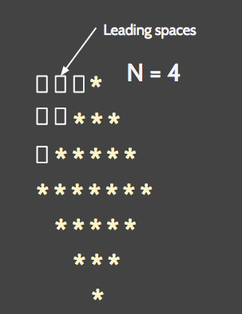

# Scientific Programming with 

## Programming Exercise 11 - Printing with Functions
Using a function to print each line, write a program that accepts a positive number N from the user and prints a full diamond of stars, where the top half has N rows and the bottom half has N-1 rows

** Reminder -  ** you learn by *doing* not watching.  Do this program yourself first!  Then watch how I did it!

### Solution Video
<iframe width="420" height="315" src="https://www.youtube.com/embed/H47QwuyPzRg" frameborder="0" allowfullscreen></iframe>

### Solution Code
[pe11.py](pe11.py)

