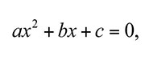

# Scientific Programming with 

## Programming Exercise 18 - The quadratic formula
Create a function call `findRoots` which accepts three parameters, a, b, and c

These parameters are constant representing a polynomial equation of the form:

You can find values of x that satisfy this equation (which are called roots) using the quadrative formula:

Notice the +/- after the -b, this equation is actually denoting two different numbers.  In addition, because the descriminate (value under the square root) could be negative, which gives us irrational numbers, polynomials may not have any real roots.  Alternatively, if the descriminate (b squared - 4ac) is zero, then there is only one root, because the + or - of 0 doesn't change the value.

Your findRoots function should return a tuple - which contains either zero, one, or both roots of the polymonial.

*Test Cases*
A = 1, B = 5,  C = 6 should give you two roots:  -2 and -3
A = 3, B = 90, C = 6 should give you two roots:  -0.06682 and -29.93318
A = 2, B = 4,  C = 2 should only give you a single root:  -1
A = 5, B = 5,  C = 6 should give you no roots

** Reminder -  ** you learn by *doing* not watching.  Do this program yourself first!  Then watch how I did it!

### Solution Video
<iframe width="420" height="315" src="https://www.youtube.com/embed/o1cf_kG2c10" frameborder="0" allowfullscreen></iframe>

### Solution Code
[pe18.py](pe18.py)

