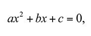
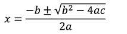

# Scientific Programming with 

## Programming Exercise 24 - A polynomial class

In an [earlier program](../pe18), we looked at root solving of polynomial equations.  A polynomial is an expression of the form:



You can find values of x that satisfy this equation (which are called roots) using the quadrative formula:



Build a Python class that has three attributes, A, B, and C.  

- It should support an `evaluate` function given a value X, returns an actual float representing the result of the polynomial when X is plugged in.
- It should support a `findRoots` function that returns a tuple representingn the roots of the polynomial (x values which yeild 0).  Return an empty tuple when there are no rational roots (see [pe18](../pe18))
- It should support the `__str__` method such that when the polynomial is printed a proper string representation is displayed.

As an example, your class should be able to work with the following program:

```python

p1 = Polynomial(1, 5, 6)
p2 = Polynomial(2, 4, 2)
p3 = Polynomial(5, 5, 6)

print("Roots for p1: ")
for root in p1.findRoots() :  # should go around twice, printing -2 and then -3
    print(root) 

print("p2 has", len(p2.findRoots()), " roots") # should print 1, since p2's root is -1 only

print("The following polynomial has no roots:, p3) # p3 should print as 5x^2 + 5x + 6

print(p1.evaluate(10)) # prints 156

```

<div class="highlight">** Reminder -  ** you learn by *doing* not watching.  Do this program yourself first!  Then watch how I did it!</div>

### Solution Video
<iframe width="420" height="315" src="https://www.youtube.com/embed/UKO7frD2fG4" frameborder="0" allowfullscreen></iframe>

### Solution Code
[pe24.py](pe24.py)


