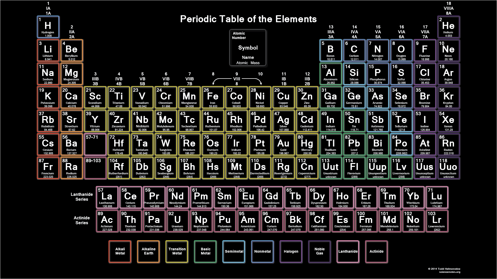

# CMPS 130 - Homework #2

In this assign you'll write a program that allows a user to explore/search the periodic table of elements and compute the molecular mass of compounds.


## Loading the data
Download the text file - [periodic_table.txt](periodic_table.txt) - and save it in the same directory as your program.  The following function accepts the name of the file (defaults to "periodic_table.txt") and returns a dictionary object representing the periodic table.  The dictionary uses the atomic symbol of the element as the key, and the value is a tuple containing the element's name, its atomic number, its atomic mass.

```python
def build_periodic_table(filename="periodic_table.txt"):
	input_file = open(filename, 'r')
	table = dict()
	for element in input_file:
		tokens = element.split()
		table[tokens[2]] = (tokens[1], int(tokens[0]), float(tokens[3]))
	return table
```


## Your program
Your program should call this function and then allow the user to use the dictionary returned as follows:

In a loop, display the following menu:
```
1) Search by symbol/name
2) Search by atomic mass
3) Molecular Mass Calculation
4) Quit

Please enter your choice:  
```

### Search by symbol/name - If user enters (1)
- Ask user for a string
- Search your dictionary for any elements whose name **OR** symbol contain the string entered (case insensitive)
- Display the list of elements, where the symbol, name, and mass are listed in columns.  
	The best way to do this is to create a function that accepts the dictionary (the periodic table) and the search string.
	1. Initialize a "result" list to empty.
	1. Iterate through the dictionary keys
		- If the key (the symbol) contains the search string (remember string has a `find` method!), add the tuple associated with the key to your result list.
		- Else, access the value (a tuple) associated with the key and if the first element (the element's name) contains the search string, add the tuple to your result list
	*Bonus +2 points for using a list comprehension instead of standard for loop!*
	1. Return the list of tuples and print them.

### Search by atomic mass - If user enters (2)
- Ask user for two floating point values - minimum and maximum mass
- Search your dictionary for any element whose atomic mass is within the range (inclusive) specified by the user
- Display the list of elements, where the symbol, name, and mass are listed in columns.  
	The best way to do this is to create a function that accepts the dictionary (the periodic table) and the min/max values entered by the user.
	1. Initialize a "result" list to empty.
	1. Iterate through the dictionary keys
		- Access the value associated with the key (a tuple) and if the third element (the mass) is >= than min and <= max, add the typle to your result list
	*Bonus +2 points for using a list comprehension instead of standard for loop!*
	1. Return the list of tuples and print them.

### Molecular Mass Calculation - If user enters (3)
- Ask the user to enter a molecular formula.  We'll use the following input method to keep things simple:
	1. Ask user to enter symbol.  They may enter `.` (a period) if there are no more symbols
	2. Ask user how many atoms of the symbol are in the molecule (they must enter an integer)
	Repeat Steps 1 and 2 until user enters . for the atomic symbol

- You should construct a list of tuples to represent this formula, where each entry in the list is a tuple whose first element is the symbol and second element is the number of atoms.  For example, the molecule BaCl<sub>2</sub> should be represented as the following list:

	```
	[(Ba, 1), (Cl, 2)]
	```
- Now lookup each element in the molecule.  If the atom is not valid (not in your periodic table), simply stop the calculation and tell the user the molecular formula contains an unknown element.  Otherwise, compute the weighted total for the molecule.  Going through the list, you'd calculate the molecular mass as `1 * 137.327 (mass of Ba) + 2 * 35.4527 (mass of Cl) = 208.232`

### Quit - If user enters (4)
Exit the program!


## Sample Output
While your output might not look **exactly** like mine, it should look close.  Here's a sample output - pay attention to the test cases, you should definately have the exact same **answers** as mine!

```
Loaded Periodic Table!
1) Search by symbol/name
2) Search by atomic mass
3) Molecular Mass Calculation
4) Quit
Please enter choice:  2
Please enter minimum mass:  10
Please enter maximum mass:  20

    #  Element name                  Sym  Mass
================================================================================
    7  Nitrogen                      N    14.0067
    9  Fluorine                      F    18.9984032
    8  Oxygen                        O    15.9994
    5  Boron                         B    10.811
    6  Carbon                        C    12.0107
================================================================================

1) Search by symbol/name
2) Search by atomic mass
3) Molecular Mass Calculation
4) Quit
Please enter choice:  1
Please enter search string:  g

    #  Element name                  Sym  Mass
================================================================================
   31  Gallium                       Ga   69.723
    1  Hydrogen                      H    1.00794
    7  Nitrogen                      N    14.0067
   32  Germanium                     Ge   72.64
  106  Seaborgium                    Sg   266.0
   18  Argon                         Ar   39.948
   80  Mercury                       Hg   200.59
    8  Oxygen                        O    15.9994
  111  Roentgenium                   Rg   272.0
   64  Gadolinium                    Gd   157.25
   25  Manganese                     Mn   54.938045
   74  Tungsten                      W    183.84
   47  Silver                        Ag   107.8682
   12  Magnesium                     Mg   24.305
   79  Gold                          Au   196.966569
================================================================================

1) Search by symbol/name
2) Search by atomic mass
3) Molecular Mass Calculation
4) Quit
Please enter choice:  3

Enter atomic symbol of element:  Ba
Enter number of atoms of Ba in molecule:  1
Enter atomic symbol of element:  Cl
Enter number of atoms of Cl in molecule:  2
Enter atomic symbol of element:  .
The molecular mass is  208.233

1) Search by symbol/name
2) Search by atomic mass
3) Molecular Mass Calculation
4) Quit
Please enter choice:  4
```
