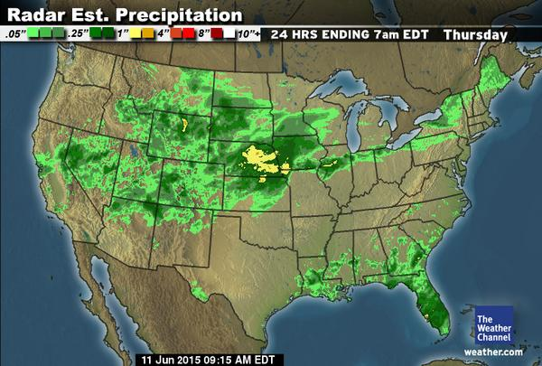

# CMPS 130 - Homework #3


For this assignment you will create a class that represents the rainfall data we've been working with in programming exercises [20](../../exercises/pe20/), [21](../../exercises/pe21/), and [23](../../exercises/pe23/).

You are asked to implement several additional calculations based on rainfall data as methods of your class.  

Please also be sure to review the sample "main" part of your program at the bottom of this page, as I will use this *exact* code to test your class.  Pay attention to detail - your methods must behave *exactly* as specified!

<div style="clear:both"/>
## Part 1 (50 points)
Design a class called `RainfallTable` which has an `__init__` function that accepts as a parameter a path to the rainfall data file.  For example, you'd instantiate an instance of the class like so:

```python
table = RainfallTable('../../data/njrainfall.txt')
```

Your class should read the file (see programming exercises [20](../../exercises/pe20/), [21](../../exercises/pe21/)) and store them in a suitable data structure (I used lists in pe20, a dictionary in pe21 - take your pick or devise a different way, its up to you!).

Your class must also support the following four **methods**:

```python
def get_rainfall(self, year, month):
    """ Returns the rainfall associated with 
        the given year and month.  Both values
        are assumed to be integers (month given
        as 1-12, year as a four digit year).
        Raises an exception if the year/month 
        combination are not found
    """

def get_average_rainfall_for_month(self, month):
    """ Returns the average rainfall associated with 
        the given month across all years in the table.  
        Month is assumed to be an integer (1-12.
        Raises an exception if the month is not valid.
    """

def get_min_year(self):
    """ Returns the minimum year in the table """

def get_max_year(self):
    """ Returns the maximum year in the table """

```

## Part 2 (30 points)
Implement the following *additional* methods in yoru RainfallTable class:

```python
def get_median_rainfall_for_month(self, month):
    """ Returns the median* rainfall associated with 
        the given month across all years in the table.  
        Month is assumed to be an integer (1-12.
        Raises an exception if the month is not valid.
    """
def get_average_rainfall_for_year(self, year):
    """ Returns the average rainfall in
        the given year across all months.
        Raises exception if year is not
        in table
    """
def get_median_rainfall_for_year(self, year):
    """ Returns the median rainfall in
        the given year across all months.
        Raises exception if year is not
        in table
    """
```
* [median](http://www.math.toronto.edu/lshorser/Averages.pdf) requires you to sort the data, so you'll need to create a temporary list.

## Part 3 (10 points)
Create two *generator* methods (see section 8.3.1 in the text) that allow a caller to iterate through rainfall data by year (all months in the year), or by month (all years for a given month).  The should look like the following (but remember, they don't return a list, they should `yeild` values!)

```python
def get_all_by_year(self, year):
    """ Returns the rainfall values for each
        month in the given year.  Raise exception
        if year is not found
    """

def get_all_by_month(self, month):
    """ Returns the rainfall values for each
        year during the given month.  Raise exception
        if month is not valid
    """
```

## Part 4 (10 points)
Add a new method, called `find_droughts` to your class.  For the purposes of this assignment, a "drought" is any time there are **three** consecutive months where the monthly rainfalls are at least 5% less than the monthly median value.  Return a list of strings that represent each drought as a month/year.  For example, if (and I'm not actually looking at the data while I type this!) September, October, November, December, and January are had 5% less rainfall in each month than their monthly median value in 1978-1979, return a list with (at least) a string looking like 9/1978 - 1/1979.  Your returned list should actually have all the droughts though...

```python
def get_droughts(self) :
    """ returns a list of strings, representing date (month/year) ranges
        where three or more months in a row had at least 5% less rainfall than
        their historical monthly medians
    """
```

# The main part of the program
I will grade your class by running the following code.  You may submit your own test code with your file as well, but I will replace it with the following:

```
table = RainfallTable("../../data/njrainfall.txt")
print(table.get_rainfall(1993, 6))
print(table.get_average_rainfall_for_month(6))

for year in range(table.get_min_year(), table.get_max_year()+1) :
    print("Average rainfall in ", year, "=", table.get_average_rainfall_for_year(year))
    print("Median rainfall in ", year, "=", table.get_median_rainfall_for_year(year))
    print("===========")
    for rain in table.get_all_by_year(year):
        print(rain, end='\t')
    print("\n===========")


for month in range(1, 13) :
    print("Average rainfall in month", month, "=", table.get_average_rainfall_for_month(month))
    print("Median rainfall in month", month, "=", table.get_median_rainfall_for_month(month))
    print("===========")
    for rain in table.get_all_by_month(month):
        print(rain, end='\t')
    print("\n===========")

for d in table.get_droughts() :
    print("Drought:  ", d)

```