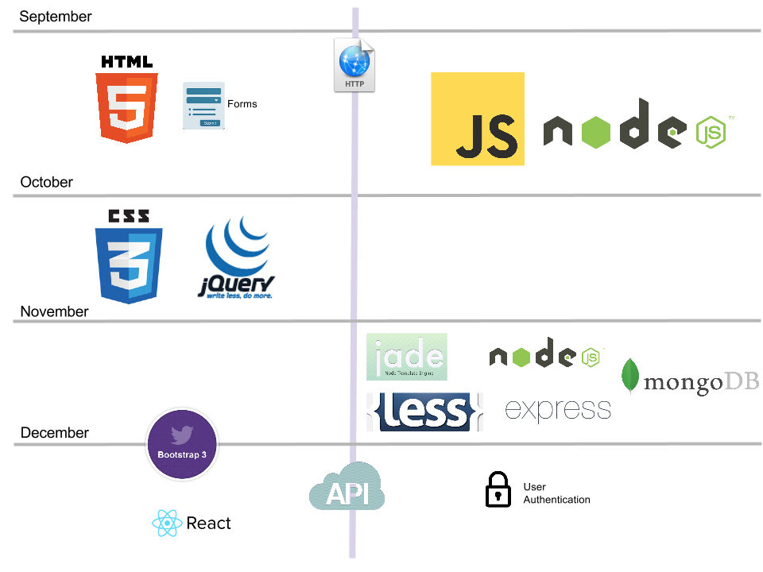

# CMPS 369 Fall 2018

## Web Application Development

**Meeting Time:** Mondays and Thursday 2:15pm-3:55pm
**Location:** ASB 429
**Professor:**&nbsp;&nbsp;Scott Frees, Professor of Computer Science

** Contact Information**
Office&nbsp;&nbsp;G315
Phone&nbsp;&nbsp;(201) 684-7726
Email&nbsp;&nbsp;[sfrees@ramapo.edu](mailto:sfrees@ramapo.edu)

**Office Hours:**  Mondays 4-5pm and Thursdays 4-5:30pm, by appointment.

## Course Description
This course provides in-depth treatment of the critical languages, design patterns, and technologies underpinning all of modern web application development. The basics of networking, along with the details of the HTTP protocol are introduced. HTML (through version 5), CSS (through version 3) are presented from the perspective of an application developer.
JavaScript is covered as the primary language for both client side development (utilizing jQuery and other front-end libraries) and server side (utilizing the node.js library).

Advanced JavaScript topics such as closures and asynchronous programming are covered in depth.
The course also introduces the MVC (Model View Controller) architecture for web development and covers the Express framework including EJS and Jade templating, along with front-end tools like LESS, Bootstrap, and React.

An overview of other popular languages and frameworks such as LESS, Ruby on Rails, ASP.NET MVC, and PHP are also provided to increase the breadth of the students’ knowledge in the field.

Note, this course is taught under the assumption that the student has programming knowledge and experience in an object-oriented language such as C++ or Java, as it JavaScript is used extensively throughout the semester. The emphasis of this course is web development from an application programmer’s perspective. It is a technical course, not suitable for students without an adequate background in computer science.

## Content Map
We'll be bouncing back and forth between server-side and client-side technologies throughout the semester.  On the server (right side of the picture below), all of our work will be based on Node.js, and we'll start out by looking at JavaScript fundamentals in detail.  We'll migrate to looking at frameworks (express), data access (MongoDB), and more advanced topics later in the semester.

In the beginning of the term, client-side (left side of picture) will be focused on core technologies - HTML, CSS, and JavaScript/jQuery.  Towards the end of the semester we'll look at big productivity boosters like Twitter's Bootstrap and Facebooks' React.

# Course Requirements
This course is taught under the assumption that the student has programming knowledge and experience in an object-oriented language such as C++ or Java, as it JavaScript is used extensively throughout the semester. The emphasis of this course is web development from an application programmer’s perspective. **It is a technical course, not suitable for students without an adequate background in computer science.**

## Pre-Requisites
**CMPS 311** - Operating Systems
No prior experience in web development is required, however students are expected to have strong programming skills in an object oriented language such as C++, Java, or C# prior to taking this course.

## Text books

[Beginning HTML and CSS](http://www.amazon.com/Beginning-HTML-CSS-Rob-Larsen/dp/1118340183)

by Rob Larson

ISBN-10: 1118340183
ISBN-13: 978-1118340189

**Required**

[JavaScript - the definitive guide - 6th Edition](http://www.amazon.com/JavaScript-Definitive-Guide-Activate-Guides/dp/0596805527)

by David Flanagan

ISBN-10: 0596805527  ISBN-13: 978-0596805524

**Required**

[Professional Node.js: Building Javascript Based Scalable Software](http://www.amazon.com/Professional-Node-js-Building-Javascript-Scalable/dp/1118185463)

by Pedro Tiexeira

ISBN-10: 1118185463  ISBN-13: 978-1118185469

**Recommended**

## Course Materials - Required Programs
This course will require you to write HTML, CSS, and JavaScript code. A simple text editor is all that is necessary, however installing a good programming editor is highly recommended. In addition, you will also need to install Node.js. Node.js, along with many programming text editors, are available on all major operating systems (Windows, Mac OS X, Linux).
It is highly recommended that you have access to your own computer to do your development on, most machines in college labs will not have Node.js installed. However, for assignments only dealing with client-side programming, you may be able to use any machine in the labs.

## Course Materials - Program Editors
While your basic text editor will allow you to write HTML/CSS and JavaScript, it can be quite error prone without an editor that supports automatic indentation and syntax highlighting. There are many possibilities. 

- [Sublime Text](http://www.sublimetext.com/) - runs on Windows, Mac OSX, Linux. (Note, the free trial works forever...)
- [Github's Atom](https://atom.io/) - runs on Windows, Mac OSX, Linux.  Free.
- [Microsoft's VS Code](https://code.visualstudio.com) - runs on Windows, Mac OSX, Linux.  Free

If you wish, you can also use larger integrated development environments (IDE), such as Microsoft Visual Studio or eclipse, Web Storm, etc. Use of a full-fledged IDE is not necessary however, and most web developers prefer to use light-weight editors such as those listed above.

# Course Structure
This website is the sole place I will link HW assignments, slides, and code.  We will use MOODLE only for assignment submission.

## Schedule

    <iframe src="https://docs.google.com/spreadsheets/d/1LDNTAOORV8aGnhkfJpT06Noa1JeTjxTEng8nkpPdH6A/pubhtml?gid=103028565&single=true" frameborder="0" style="overflow:hidden;overflow-x:hidden;overflow-y:hidden;height:1200px;width:100%;" height="100%" width="100%"></iframe>

## Other slides/Resources

<a href="slides_pdf">Slides in PDF form (for printing)</a>

<a href="https://docs.google.com/presentation/d/1HfTdhszJ43I1lIgbff8VvQ4jQudB3Z4IPqJ56IqMcr4/pub?start=false&loop=false&delayms=3000">Exam 1 Review Slides</a>

# In-Class Code

## Networking Examples  (Lecture 2 - 3)
- [C++ and Node Echo Servers](code/basic-servers.zip)
- [http.js](code/server-demos/http.js)

## HTML Service (Lectures 3-7)
- [03_http_file_demo](code/03_http_file_demo.zip)

## HTML Form processing and EJS Templates (Lectures 8-9)
- [05_form_processing_demo](code/05_form_processing.zip)
- [06_form_templates_demo](code/06_form_templates.zip)
- [07_guessing_game_1_demo](code/07_guessing1.zip)
- [08_guessing_sessions](code/08_guessing_sessions.zip)

## JavaScript Examples
- [09_js_examples](code/09_js_examples.zip)
- [10_guessing_spas](code/10_guessing_spas.zip)
- [11_jquery](code/11_jquery.zip)
- [12_guessing_ajax](code/12_guessing_ajax.zip)

## Database Examples
- [14_mongodb_example](code/14_mongodb_example.zip)
- [15_guessing_mongo](code/15_guessing_mongo.zip)

## Express Examples
- [16_guessing_express.zip](code/16_guessing_express.zip)
- [17_guessing_pug.zip](code/17_guessing_pug.zip)
- [18_guessing_less.zip](code/18_guessing_less.zip)
- [19_guessing_bootstrap.zip](code/19_guessing_bootstrap.zip)

## Authentication / Passport example
- [20_guessing_secure.zip](code/20_guessing_secure.zip)

## Reactive example
- [21_guessing_vue.zip](code/21_guessing_vue.zip)

# Homework Assignments
There are three homework assignments and two larger programming projects assigned for this course.  

|Link to Homework Assignment| Due Date
|--|----
| [Homework 1](https://docs.google.com/document/d/1TFvoSgDqj26uk0F_ffVI600D0184hPugJYQURaImD4c/pub) |  9/20
| [Homework 2](https://docs.google.com/document/d/1vD8UQT-ot7BDysyKRHCsvrRHsOkxv-rYCnnkpmbnNnc/pub) |  9/25
| [Homework 3](https://docs.google.com/document/d/1SY9-yYsalcCoK1JLLHJqcuBNH-lkB3KM1J3xZ2g3BgM/pub) |  10/25

|Link to Projects| Due Date
|--|----
| [Project 1](https://docs.google.com/document/d/1P_cGhz1tsRNYKk7KvCRNXDdZwdyP70iv3CJ2Zc5hmDU/pub) |  10/15
| [Project 2](projects/maps.html) |  11/22

# Final Project
The final project will be due the same day as our scheduled final exam.  The full details can be found [here](https://docs.google.com/document/d/1lfnxI3C_44m9MwZaBxAtfBb9w6jciJvoIsSQw40mXvg/pub).  You will show me your running code during the final exam period.  The final project is **instead** of the final exam.

# Grading

| % | Activity
|------------------:|:---------------
|15%| Homework Assignments (3)
|20%| Programming Projects (2)
|40%| Exams (2)
|25%| Final Project (in place of Final Exam)

## Late Policy

All assignments will be turned in electronically. A late penalty of 10 points per day will be applied to all late assignments. No assignments over 5 days late will be accepted. The required format/method of your electronic submissions will be outlined for each assignment. Deviation from these requirements may result in a 5-point penalty.

## Attendance Policy
You are required to attend each class, late arrival (after attendance has been recorded) will count as a full absence. You are allowed 1 unexcused absence (all others will count against your attendance grade). You must have documentation to receive an “excused” absence.

## Letter Grade Assignment

| Letter | Numeric Score | Letter | Numeric Score | Letter | Numeric Score
|--------|---------------|
|A       | 100-94 |A- | 93-90 |
| B+ | 89-87 | B | 86-84 | B- | 83-80 |
|C+ | 79-77 |C | 76-74 |C-| 73-70|
|D+| 69-67|D| 66-60|F| < 60 |

# Policy on Academic Integrity
Students are expected to read and understand Ramapo College’s Academic Integrity Policy, which can be found in the Ramapo College Catalog.  Members of the Ramapo College community are expected to be honest and forthright in their academic endeavors.  Students who are suspected of violating this policy will be referred to the Office of the Provost.

When completing lab programming exercises, you may review code with your fellow students; however, copying source code is strictly forbidden.  For homework programming assignments, you may discuss ideas, however you may not allow others to see your source code or examine others’.  Sharing of source code is extremely easy to detect and is strictly prohibited.   If sharing of source code is suspected, intentional or otherwise, both parties will immediately be referred to the Office of the Provost.

# Students with Disabilities:
If you need course adaptation or accommodations because of a disability that has been documented with the Office of Specialized Services, please make an appointment during my office hours.

## Make-Up Exam Policy
Make-ups will not be given for the exams given during the semester.  Failure to attend class on those days will result in a zero.  Make-ups will only be given in extraordinary circumstances (college approved absence) such as a documented medical or religious absence.

# Students with Disabilities:
Ramapo College is committed to providing reasonable accommodations for all persons with disabilities.  If you are eligible for classroom accommodations as an individual with a disability, you are required to affiliate with The Office of Specialized Services (OSS) locating in the C Wing in room C205. OSS phone number is 201-684-7514, email is oss@ramapo.edu and website is www.ramapo.edu/oss/.   If you need course adaptation or accommodations because of a disability that has been documented with the Office of Specialized Services, please make an appointment with me.

# A Note on Sexual Misconduct 
Ramapo College is committed to fostering a safe, productive learning environment. Title IX and our college policy prohibit discrimination on the basis of sex or gender.  Sexual misconduct — including harassment, domestic and dating violence, sexual assault, and stalking are prohibited.  The College encourages anyone experiencing sexual misconduct to talk to someone about what happened, so they can get the support they need and our college can respond appropriately.
 
If you wish to speak confidentially about an incident of sexual misconduct, please contact the Counseling Center at 201-684-7522 or 201-684-6666 during nights and weekends. If you wish to report sexual misconduct or have questions about policies and procedures regarding sexualmisconduct, please contact Kat McGee, the College’s Director of Title IX at 201-684-7220.
 
The College is legally obligated to investigate reports of sexual misconduct, and therefore it cannot guarantee the confidentiality of a report, but it will consider a request for confidentiality and respect it to the extent possible.  
 
As a faculty member, I am also required by our College to report incidents of sexual misconduct and thus cannot guarantee confidentiality, but I will respect your privacy and only share the information with those who have a duty to respond. Should I become aware of an incident involving sexualmisconduct, I must provide our Title IX Coordinator with relevant details such as the names of those involved in the incident.