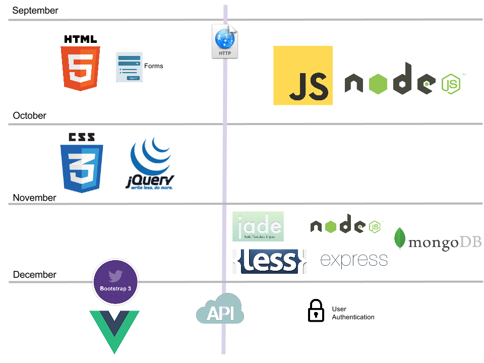

# CMPS 369 Fall 2020

## Web Application Development

**Meeting Time:** Mondays and Thursday 2:15pm-3:55pm
**Location:** Virtual:  WebEx meetings on rotating schedule
**Professor:**&nbsp;&nbsp;Scott Frees, Professor of Computer Science

** Contact Information**
Office&nbsp;&nbsp;WebEx
Email&nbsp;&nbsp;[sfrees@ramapo.edu](mailto:sfrees@ramapo.edu)

**Office Hours**
Due to the unusual circumstances of this semester, I want to be as flexible as I can in providing office hours virtually through WebEx.  All office hour visits will be **by appointment**.  Please email me at [sfrees@ramapo.edu](mailto:sfrees@ramapo.edu) to set up an appointment.  To the best of the my ability, I will attempt to schedule you for as early as the same day - but generally my availability will be between the hours of 9am and 5pm on weekdays.  All office hours will be conducted via WebEx.  **When setting up an appointment, please provide several (ideally 3) day/times that will work for you**, and I'll send you a WebEx invitation or contact you for additional day/times if none of your proposed times work.

## Virtual Course Delivery
This course will be delivered via a mix of pre-recorded video lectures and live WebEx sessions held during our normally scheduled class time.  The majority of content (about 60%) will be delivered via pre-recorded videos, I have reserved our synchronous WebEx sections for lessons that typically involve more class discussion or those that are more focused on coding.  We are scheduled for 10 WebEx sessions over the course of the semester - roughly evenly distributed throughout.  **You will receive WebEx invitations for each session** via email before the start of the semester.  It is unlikely each live session will take up the entire scheduled class period, and each session will be recorded for anyone who is unable to attend.  **I highly recommend that you make every effort to attend "in person" rather than waiting to watch the recording** - again, I've scheduled the live sessions around topics that typically generate more class discussion.

Our exams will be conducted on Canvas.  I will provide additional detail to you as we approach their dates.  You are not required to use a proctoring service (ie. webcams) while taking the exams.  Please see the policy on academic integrity at the bottom of this page.

## Course Description
This course provides in-depth treatment of the critical languages, design patterns, and technologies underpinning all of modern web application development. The basics of networking, along with the details of the HTTP protocol are introduced. HTML (through version 5), CSS (through version 3) are presented from the perspective of an application developer.
JavaScript is covered as the primary language for both client side development (utilizing jQuery and other front-end libraries) and server side (utilizing the node.js library).

Advanced JavaScript topics such as closures and asynchronous programming are covered in depth.
The course also introduces the MVC (Model View Controller) architecture for web development and covers the Express framework including EJS and Jade templating, along with front-end tools like LESS, Bootstrap, and React.

An overview of other popular languages and frameworks such as LESS, Ruby on Rails, ASP.NET MVC, and PHP are also provided to increase the breadth of the students’ knowledge in the field.

Note, this course is taught under the assumption that the student has programming knowledge and experience in an object-oriented language such as C++ or Java, as it JavaScript is used extensively throughout the semester. The emphasis of this course is web development from an application programmer’s perspective. It is a technical course, not suitable for students without an adequate background in computer science.

## Content Map
We'll be bouncing back and forth between server-side and client-side technologies throughout the semester.  On the server (right side of the picture below), all of our work will be based on Node.js, and we'll start out by looking at JavaScript fundamentals in detail.  We'll migrate to looking at frameworks (express), data access (MongoDB), and more advanced topics later in the semester.

In the beginning of the term, client-side (left side of picture) will be focused on core technologies - HTML, CSS, and JavaScript/jQuery.  Towards the end of the semester we'll look at big productivity boosters like Twitter's Bootstrap and Facebooks' React.

# Course Requirements
This course is taught under the assumption that the student has programming knowledge and experience in an object-oriented language such as C++ or Java, as it JavaScript is used extensively throughout the semester. The emphasis of this course is web development from an application programmer’s perspective. **It is a technical course, not suitable for students without an adequate background in computer science.**

## Pre-Requisites
**CMPS 311** - Operating Systems or **CMPS 240** Data Analytics in Python
No prior experience in web development is required, however students are expected to have strong programming skills in an either C++, Python, Java, or C# prior to taking this course.  JavaScript experience is a plus, but is not required.

## Text books

[Beginning HTML and CSS](http://www.amazon.com/Beginning-HTML-CSS-Rob-Larsen/dp/1118340183)

by Rob Larson

ISBN-10: 1118340183
ISBN-13: 978-1118340189

**Required**

[JavaScript - the definitive guide - 6th Edition](http://www.amazon.com/JavaScript-Definitive-Guide-Activate-Guides/dp/0596805527)

by David Flanagan

ISBN-10: 0596805527  ISBN-13: 978-0596805524

**Required**

## Course Materials - Programming Environment
This course will require you to write HTML, CSS, and JavaScript code. A simple text editor is all that is necessary, however installing a good programming editor is highly recommended. In addition, you will also need to install Node.js. Node.js is available on all major operating systems (Windows, Mac OS X, Linux).

It is highly recommended that you have access to your own computer to do your development on, most machines in college labs will not have Node.js installed. However, for assignments only dealing with client-side programming, you may be able to use any machine in the labs.

While your basic text editor will allow you to write HTML/CSS and JavaScript, it can be quite error prone without automatic indentation and syntax highlighting. There are many possibilities. 

- [Sublime Text](http://www.sublimetext.com/) - runs on Windows, Mac OSX, Linux. (Note, the free trial works forever...)
- [Github's Atom](https://atom.io/) - runs on Windows, Mac OSX, Linux.  Free.
- [Microsoft's VS Code](https://code.visualstudio.com) - runs on Windows, Mac OSX, Linux.  Free

If you wish, you can also use larger integrated development environments (IDE), such as Microsoft Visual Studio or eclipse, Web Storm, etc. Use of a full-fledged IDE is not necessary however, and most web developers prefer to use light-weight editors such as those listed above.

# Schedule
Please note, for days indicated as having a **Live WebEx**, you will recieve a WebEx invitiation in your email, which can be added to your calendar.  For sessions indicating a **pre-recorded video lesson**, the video will be posted to Canvas shortly before the scheduled lesson.  You certainly can review those videos at any time that is convenient to you - however you are expected to view them before the next WebEx or Exam on the schedule.

    <iframe src="https://docs.google.com/spreadsheets/d/e/2PACX-1vTHQMvV9lNyyLIvrYTmDdKK_MCWNJpG-tSb0Ti2A8vJ1MEtjDMj2Zhf16xroNeInLd_ustfsYGyRg3o/pubhtml?gid=103028565&single=true" frameborder="0" style="overflow:hidden;overflow-x:hidden;overflow-y:hidden;height:800px;width:100%;" height="100%" width="100%"></iframe>

## Other slides/Resources
**Due to the nature of this semester's course delivery model, some of the PDFs below may be out of date.  I will be updating them shortly before their scheduled discussion.  Please avoid printing them all out well in advance**.

<a href="slides_pdf">Slides in PDF form (for printing)</a>

<a href="https://docs.google.com/presentation/d/1HfTdhszJ43I1lIgbff8VvQ4jQudB3Z4IPqJ56IqMcr4/pub?start=false&loop=false&delayms=3000">Exam 1 Review Slides</a>

# In-Class Code

## Networking Examples  (Lecture 2 - 3)
- [C++ and Node Echo Servers](code/basic-servers.zip)
- [http.js](code/server-demos/http.js)

## HTML Service (Lectures 3-7)
- [03_http_file_demo](code/03_http_file_demo.zip)

## HTML Form processing and EJS Templates (Lectures 8-9)
- [05_form_processing_demo](code/05_form_processing.zip)
- [06_form_templates_demo](code/06_form_templates.zip)
- [07_guessing_game_1_demo](code/07_guessing1.zip)
- [08_guessing_sessions](code/08_guessing_sessions.zip)

## JavaScript Examples
- [09_js_examples](code/09_js_examples.zip)
- [10_guessing_spas](code/10_guessing_spas.zip)
- [11_jquery](code/11_jquery.zip)
- [12_guessing_ajax](code/12_guessing_ajax.zip)

## Database Examples
- [14_mongodb_example](code/14_mongodb_example.zip)
- [15_guessing_mongo](code/15_guessing_mongo.zip)

## Express Examples
- [16_guessing_express.zip](code/16_guessing_express.zip)
- [17_guessing_pug.zip](code/17_guessing_pug.zip)
- [18_guessing_less.zip](code/18_guessing_less.zip)
- [19_guessing_bootstrap.zip](code/19_guessing_bootstrap.zip)

## Authentication / Passport example
- [20_guessing_secure.zip](code/20_guessing_secure.zip)

## Reactive example
- [21_guessing_vue.zip](code/21_guessing_vue.zip)

# Homework Assignments
There are three homework assignments and two larger programming projects assigned for this course.  The assignments will be posted to Canvas.

# Final Project
The final project will be due the same day as our scheduled final exam.  The full details can be found [here](https://docs.google.com/document/d/1lfnxI3C_44m9MwZaBxAtfBb9w6jciJvoIsSQw40mXvg/pub).  You will show me your running code during the final exam period.  The final project is **instead** of the final exam.

# Grading
| % | Activity
|------------------:|:---------------
|20%| Homework Assignments (3)
|25%| Programming Projects (2)
|25%| Exams (2)
|30%| Final Project (in place of Final Exam)

## Late Policy
All assignments will be turned in electronically. A late penalty of 10 points per day will be applied to all late assignments. No assignments over 5 days late will be accepted. The required format/method of your electronic submissions will be outlined for each assignment. Deviation from these requirements may result in a 5-point penalty.

## Attendance Policy
This semester, this course is being delivered virtually.  Although I strongly urge you to attend all synchronous live WebEx sessions, so you have the opportunity to ask questions, all sessions will be recorded and posted on campus.  There is no attendance grade for this course.

## Letter Grade Assignment

| Letter | Numeric Score | Letter | Numeric Score | Letter | Numeric Score
|--------|---------------|
|A       | 100-94 |A- | 93-90 |
| B+ | 89-87 | B | 86-84 | B- | 83-80 |
|C+ | 79-77 |C | 76-74 |C-| 73-70|
|D+| 69-67|D| 66-60|F| < 60 |

# Policy on Academic Integrity
Students are expected to read and understand Ramapo College’s Academic Integrity Policy, which can be found in the Ramapo College Catalog.  Members of the Ramapo College community are expected to be honest and forthright in their academic endeavors.  Students who are suspected of violating this policy will be referred to the Office of the Provost.

When completing lab programming exercises, you may review code with your fellow students; however, copying source code is strictly forbidden.  For homework programming assignments, you may discuss ideas, however you may not allow others to see your source code or examine others’.  Sharing of source code is extremely easy to detect and is strictly prohibited.   If sharing of source code is suspected, intentional or otherwise, both parties will immediately be referred to the Office of the Provost.

# College-Wide Policies
Please see the [College’s web page](https://www.ramapo.edu/fa/arc/college-wide-policies-courses) on policies that apply to all RCNJ courses, including this one.