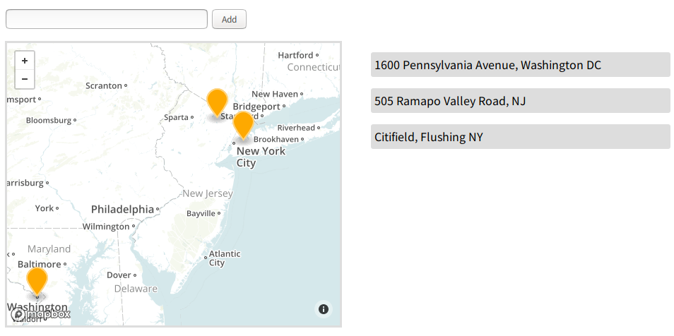
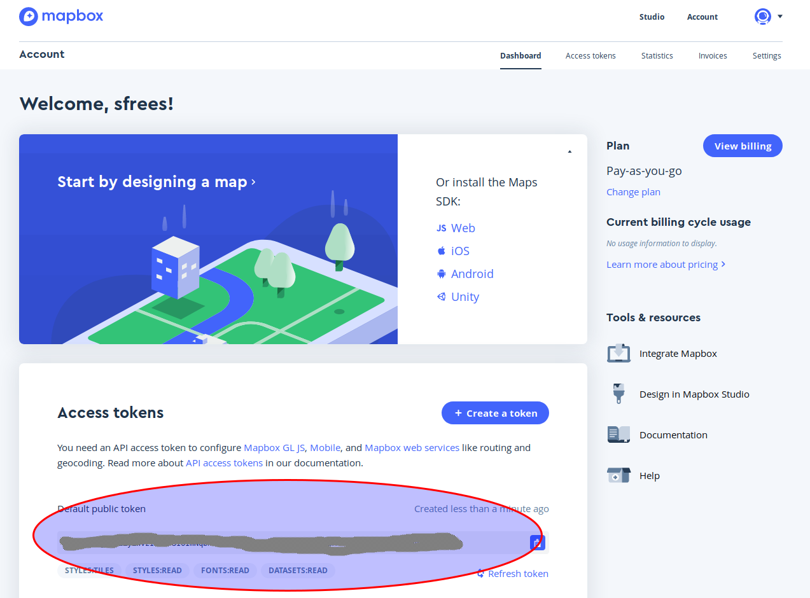

# CMPS 369 - Programming Project #2
## Geocoding with JavaScript

Geocoding is the process of turning a human-understandable address like 505 Ramapo Valley Road Mahwah, NJ 07430 into latitude / longitude coordinates suitable for putting on a map.

```
Latitude:     41.08394699999999
Longitude:    -74.176609
```

Geocoding is hard, it's not something you can do yourself - it's extremely data intensive.  There are many (web) services online that let you do geocoding for free however.  

For this assignment, you will design a client-side, browser only application that lets a user type a series of addresses into a text box.  Each time they enter an address, you are will use JavaScript (you may utilize jQuery)  to issue an AJAX request for the geocoding information.  You will display a map (see below) and place a marker on the map corresponding to the location returned.  

Each address the user enters will be listed vertically on the right, you’ll need to dynamically create the elements in JavaScript  after adding them to the map.  As a final requirement, whenever the user clicks on one of the previous addresses listed on the right, the map should automatically center on that particular location. 



You will use Leafletjs and MapBox to make all this happen.  While you must stick to the basic layout I’ve presented, you can use a bit of artistic licence to make it look nicer.

## Frequently asked question:

**Question**:  You didn’t teach Leafletjs or MapBox… what is going on?

**Answer**:  Welcome to the world of web development!  You will never succeed in this field unless you can learn to read documentation, use examples, and teach yourself new techniques.  I can assure you, we’ve covered the JavaScript, CSS, AJAX, and HTML concepts you need to make sense out of the APIs below

## About Leafletjs and MapBox
Leafletjs is an open source library for displaying maps, adding markers, and doing geocoding.  It's a great library, but it doesn’t actually come with the map data itself - it allows you to plug in providers.  Providers typically require you to create an account with them, so they can limit the number of API requests you make.  This is because both map generation and geocoding are resource intensive - there is a limit to what they can give away.

There are many providers - Google Maps being a very popular one.  Google Maps requires a credit card - so it's not great for toy (or homework) programs.  MapBox is an alternative provider, which does not require a credit card to get started, and has extremely generous limits on their API.  At the time of this writing, your first 50,000 maps and geocoding requests per month are free.  If you exceed this while developing your program… you need to come to office hours more often.

## Creating a MapBox Account
Go to [https://www.mapbox.com/signup/](https://www.mapbox.com/signup/) and create an account.  Once you’ve signed up, you’ll receive a default API Key.  Use this key in the necessary line of code (see examples below).




## Using Leaflet.js
The following external scripts/styles will need to be added to your HTML before getting started:

```
https://api.mapbox.com/mapbox.js/v3.1.1/mapbox.js
https://api.mapbox.com/mapbox.js/v3.1.1/mapbox.css
```

There are some simple tutorials found here:  [https://leafletjs.com/index.html](https://leafletjs.com/index.html).   Below are some hints that you can use if you wish.

### Creating a simple map
```
L.mapbox.accessToken = ‘YOUR TOKEN GOES HERE;      
const map = L.mapbox.map('map', 'examples.map-h67hf2ic');
```

In the line above - the “L” object comes from the mapbox.js code you linked to your HTML page.  Feel free to substitute the example map style, or instantiate the map using other techniques listed on Leaflet.js’s documentation - you are completely free to do this however you want.

### Geocoding
```
const print_location = (err, data) => {
    if (err ) return console.error(‘ugh...’);
    if (data.latlng) console.log(data.latlng);
    else console.log(‘Place couldn’t be located’);
}
L.mapbox.accessToken = ‘YOUR TOKEN GOES HERE; // you only need to do this once...
const geocoder = L.mapbox.geocoder('mapbox.places')
geocoder.query('505 Ramapo Valley Road, NJ', print_location);
```

If you’ve set things up well, the code above will print out the latitude and longitude coordinates of Ramapo.  Feel free to look at all the properties of the data object - there’s lots of information available.

### Adding a Marker
The code below will add a marker to a map around Ramapo...

```
const map = L.mapbox.map('map', 'examples.map-h67hf2ic');
const marker = {
     icon: L.mapbox.marker.icon({
               'marker-size': 'large',
               'marker-color': '#fa0'
           })};

L.marker([40, -74], marker).addTo(map);
```

*The rest is up to you!*
