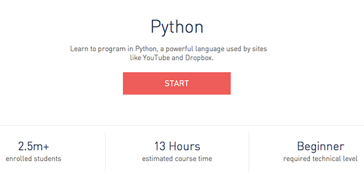

# HNRS 420 Spring 2016
## Computation and Society

**Meeting Time:  **&nbsp;&nbsp;Mondays and Thursdays, 2:00-3:40pm
**Location:  **&nbsp;&nbsp;A Building, Room 218
**Professor:**&nbsp;&nbsp;Scott Frees, Professor of Computer Science

** Contact Information**
Office&nbsp;&nbsp;G315
Phone&nbsp;&nbsp;(201) 684-7726
Email&nbsp;&nbsp;[sfrees@ramapo.edu](mailto:sfrees@ramapo.edu)

## Course Description
The focus of this course is the exploration of how computers have, and continue to transform our society.  The course will begin with a historical, and hands-on study of how a computer and the software that drives it is created, including a topical treatment of programming to familiarize the student with computing.  The course will then focus on the major innovations that computing is enabling in our society, and how these impact economics, ethics, and law.  This will include topics such as hacking and identity/financial fraud, crypto currencies such as Bitcoin, data mining and privacy issues, and the effects of automation and computerization on economic and social imbalances.  This course does not assume any previous experience in computer programming.

## Pre-Requisites

College Honors Program Admission. 
Permission of Instructor required.

## Course Materials
Most of the reading required in this course will be material freely available on the web.  For each week, a listing of several (shortish) articles will be posted (see the individual lecture pages, accessible from the links in the 'Course Topics' section).

There are two books the class is **required to read**, which will be discussed in detail throughout the semester.  The first, [The Innovators](http://www.amazon.com/The-Innovators-Hackers-Geniuses-Revolution/dp/147670869X/ref=br_lf_m_239332_1_4_ttl?ie=UTF8&s=books&pf_rd_p=1953735202&pf_rd_s=center-2&pf_rd_t=1401&pf_rd_i=239332&pf_rd_m=ATVPDKIKX0DER&pf_rd_r=1GM630QHX1T0PM1CW3AB), will give you a glimpse into some of the most important people in the history of computing.  The second, [Who Owns the Future](http://www.amazon.com/exec/obidos/ASIN/1451654960/simonsayscom), presents a fairly opinionated discussion/idea about where technology and specifically computers are taking society.  These books will provide some common ground for the class to draw upon during debates and presentations.

 

### Reading Schedule
I am not rigidly structuring your progress through the two text’s (“The Innovators” and “Who Owns the Future”) – you may read roughly at your own pace.  However - here are my guidelines:

| The Innovators   | Who Owns the Future?    |
|:------|:--------|
| Read Chapters 1-5 by 3/3|Read Parts 1-3 by 3/3 |
| Read Chapters 6-9 by 4/7|Read Parts 1-3 by 3/3 |
| Complete the book by 4/25|Complete book by 3/28 |

## Course Topics
Most lectures will include student debate or presentations.  The schedule and assignments for these will be listed on the associated lecture's page, you can access them by clicking on the topic below.  

*Note, each lecture page also lists the assigned readings and the course material (lecture slides, including those used by students).  **SO CLICK THE LINKS!!!***

    <iframe src="https://docs.google.com/spreadsheets/d/1_pB5AIO0ficNyAmCif8DgGO3YU7ovYchBJJK0kGWQ-o/pubhtml?gid=0&amp;single=true&amp;widget=true&amp;headers=false" frameborder="0" style="overflow:hidden;overflow-x:hidden;overflow-y:hidden;height:800px;width:100%;" height="100%" width="100%"></iframe>

## Lecture Organization
This is a highly collaborative and participation-based course.  During the majority of the class periods, discussion will be led by students.  On the course schedule, note there are four types of lectures listed:

1. **Lecture** - during these classes I will lead the discussion.  Normally these types of classes precede debates, I will provide the class with background on a particular topic, in order to foster a better discussion during the next class period.  
2. **Debate Team Meetings** - Five of the class times listed are dedicated to meetings with debate teams.  During these meeting times, I will work with the designated debate teams on their upcoming presentation, in order to ensure the debates engage the class well.  *Students not on the designated debate teams do not need to attend these lectures*.
2. **Debates** - during these classes two student teams will debate a set of questions/topics that relate to the previous lecture.  Full class participation is expected, the debate team is expected to engage the class in discussion.
3. **Presentations** - In addition to debates, students will be assigned to be on a team that makes three presentations throughout the semester.  These presentation are outlined in more detail below.

## Course Assignments

### Presentations
Students will be grouped (by the instructor) into teams of 3 for three presentations to be made during the semester.  Presentations will be 15 minutes long, plus 5-10 minutes Q & A.  

While the general themes of the presentations are set, the specific topic is up to the team to decide, and to have approved by me.  **Each team must have their topic approved no less than one week ahead of the presentation date**.

[Presentation Teams Assignments](presentations.html)

#### Presentation 1 - Security Disasters (2/22)
The first presentation will be on a specific instance where security issues have had a significant effect on the public.   This can be related to identity/financial fraud, privacy infringement (by hackers, companies, or the government), and infrastructure (cyber-terrorism, bugs).  

#### Presentation 2 - Disruption (3/31)
The second presentation will focus on how technology has drastically changed certain industries, almost to the extent that they no longer (or soon will not) exist.  Potential industries could include print media, commercial driving, medical, law, or just about any industry!  Students are especially encouraged to pick industries that may intersect with their majors.  

#### Presentation 3 - Emerging Technologies (4/21)
The third presentation is focused on an emerging technology.  Here are the potential topics:

* Quantum Computing - what does this mean for computing power?
* Autonomous Vehicles - From drones to self-driving cars - what will we be using in 5 years?
* 3D Printing - where is this going?
* Machine learning - are we seeing the beginning of a AI revolution?

### Debates
The purpose of the team is not only to debate each other, but to be "subject matter" experts and help frame the class's discussion.  Your grade will be based on (1) how well you understand the problem/topic, (2) how persuasively you make your arguments, and (3) how well you get the rest of the class involved in the discussion.

[Please see the debate schedule for details](debates.html).

### Essays
You will be required to write two essays.  Your grade will be based on how compelling of a topic you choose and the level of research, accuracy, and logic applied to your discussion and conclusions.  

**Each essay is expected to be 5-7 pages, double spaced (1.25" margins, 12pt font)**.

#### Essay 1:  Seminal Events in Computing (due 3/10)
Select a particular event, or invention/software release that you feel has "changed the world".  Do a deep-dive into how that event came to pass - who were the major players, what were the enabling events?
#### Essay 2:  Computing and your major (due 5/2)
You must select an industry tied to your major, and explore how technology has changed it, or is in the process of changing it.  How has it helped the specific industry (the product)?  How has it effected the workforce?  Has this been a net-positive for society?  

### Learning to code
The focus of this course is not to make you an expert in program, by any stretch.  However, there is a lot to be learned by walking a mile in the shoes of a programmer.  A valuable component of this course will be the completion
of a beginners tutorial in Python programming.  Python is a very beginner-friendly language, but is used extensively in both small and huge programming projects alike.

By 4/18, You are required to complete all lessons in [Code Academy's Python Course](http://www.codecademy.com/en/tracks/python).  

Please see the [programing schedule](programming.html) for due dates for each lesson

## Grading

| % | Activity
|------------------:|:---------------
|30%|Your participation in during times where you are not leading the debate/presentation
|20%|Your effectiveness during debates (while leading the debate)
|20%|Your presentations
|20%|Your essays
|10%|Your coding assignment (codeacademy python).
